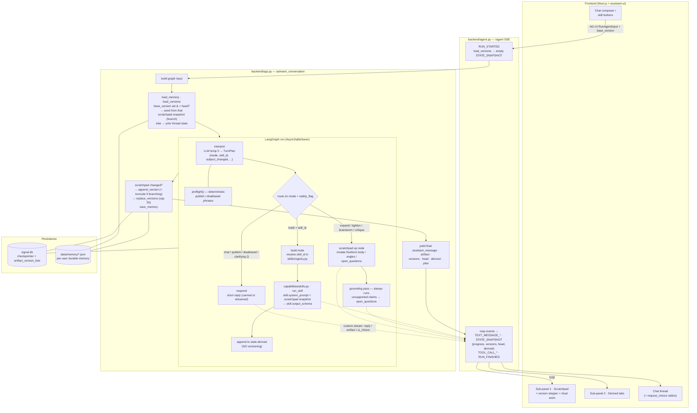

# Scratchpad

> **Status:** mid-redesign. This README describes the target "Scratchpad"
> architecture. Parts of it (the two-tier artifact, the skills registry, the
> `build` flow) are being implemented; the version-history, streaming, and
> agent-driven-UI machinery already exists and is being retargeted from the old
> "Signal" content-piece model.

Scratchpad is a **freeform thinking surface**. You jot down raw ideas about
anything and rework them with an AI collaborator until the notes feel right.
When you're happy with the scratchpad, you press a button and a **skill** turns
it into something concrete — a blog outline, a social post, a marketing
campaign. Skills are a registry you can grow.

It is **not** a research agent, a publisher, or a general Q&A bot.

## The two tiers

| Tier | What it is | Versioned? |
| --- | --- | --- |
| **Scratchpad** | One continuous freeform doc — your ideas, plus `sources` (confirmed facts), `open_questions`, and `[assumption]` / `[TK: confirm …]` markers. The durable thinking surface. | Yes — linear history, capped at 50 |
| **Derived artifacts** | The output of running a skill against the current scratchpad. Shown as browser-style tabs on the right. Each run opens a new tab. | No |

## What it does

**On the scratchpad:**

- **Expand** — take a rough note and develop it into fuller prose or bullets.
- **Tighten** — a targeted edit; nothing else changes.
- **Brainstorm** — 3–5 distinct angles / directions, with a recommendation.
- **Critique** — an editor's read; fixes land in `open_questions`.
- **Stays grounded** — uses only facts you've confirmed; unverified specifics
  become `open_questions` rather than inventions. Still-forming ideas can be
  explored with `[assumption]` framing.

**Skills (buttons, or "make this a blog outline"):**

- **Blog outline** — title, lede, 3–6 sections with subheads, a close.
- **Social post** — short, one idea, feed-first hook; this is the only place
  hashtags / CTAs / word ceilings live.
- **Marketing campaign** — a structured campaign doc.

Every skill generates **purely from the scratchpad snapshot** — it inherits the
scratchpad's facts and assumptions and adds nothing new.

## Architecture (short)

```
user turn  /  skill button
  → interpret        one structured TurnPlan, temperature 0
  → route            trusts the plan; deterministic safety check alongside
  → scratchpad ops:  expand | tighten | brainstorm | critique | chat
        → grounding pass (unsupported claims → open_questions)
        → scratchpad snapshot saved as a version
  → build (skill_id):
        → skills registry resolves the skill
        → run_skill(skill, scratchpad snapshot) → derived artifact (new tab, no version)
  → snapshots + reply streamed out; thread state saved to SQLite
```

### Agentic workflow (full)



Entry points in `backend/app.py`:

- `run_conversation(user_id, conversation_id, user_message, base_version=None)` —
  sync, one turn.
- `astream_conversation(...)` — async generator of `artifact` / `reply` /
  `status` / `ui_choice` / `final` events (used by the AG-UI adapter). The
  `final` event carries `versions` + `head` for the scratchpad history and
  `derived` for the open tabs.

## Stack

| Piece | Choice |
| --- | --- |
| Orchestration | LangGraph (`AsyncSqliteSaver` checkpointer) |
| LLM access | OpenRouter via `langchain-openai`, one factory in `backend/llm.py` |
| Scratchpad ops | `backend/capabilities/writing.py` |
| Skills | `backend/skills/registry.py` + `backend/capabilities/skills.py` |
| Prompts | sectioned + versioned in `backend/prompts.py` (`SCRATCHPAD_V4`) |
| Safety | `backend/policy.py` + `backend/guardrails.json` (see **Guardrails**) |
| Scratchpad history | `backend/versions.py` (linear list, table in `signal.db`, cap 50) |
| Web | `backend/agent.py` — AG-UI / CopilotKit-compatible SSE |
| Persistence | SQLite for threads + scratchpad versions, `data/memory/*.json` for per-user memory |
| Eval | pytest + DeepEval |

## Backend layout

```
backend/
  agent.py            AG-UI SSE endpoint; streams scratchpad + derived tabs
  app.py              LangGraph: interpret → route → scratchpad ops | build
  artifact.py         Scratchpad + DerivedArtifact models
  signal_models.py    TurnPlan (modes: expand|tighten|brainstorm|critique|chat|build, skill_id)
  prompts.py          SCRATCHPAD_SYSTEM_PROMPT + versioned history
  policy.py           deterministic guardrails
  versions.py         scratchpad version list
  guardrails.json     disallowed phrases, supported_skills, max_scratchpad_versions
  llm.py  config.py  memory_store.py  textutil.py  terminal_chat.py
  capabilities/
    writing.py        brainstorm / expand / tighten / critique / grounding (scratchpad-scoped)
    skills.py         run_skill(skill, scratchpad_snapshot) → streamed derived output
  skills/
    registry.py       Skill = {id, name, description, system_prompt, output_schema, craft_notes}
    blog_outline/  social_post/  marketing_campaign/     # one dir per skill
    brainstorming/  draft-validation/  grounded-editing/ # scratchpad-side craft notes
```

## Guardrails

Deterministic (in `policy.py` + graph structure, never a prompt):

- **No publish / send / schedule.** Publish-phrase detection → `publish_request`
  → a canned honest reply. The app produces text only.
- **Skill allow-list.** `build` runs only a `skill_id` in `guardrails.json`'s
  `supported_skills`; anything else → "I can build blog outline / social post /
  marketing campaign — which?".
- **Snapshot-only skill input.** `run_skill()` receives just the scratchpad
  snapshot dict — no transcript, no web, no external data.
- **Outputs are outputs.** The `build` node only appends to `state.derived`; a
  skill can't mutate the scratchpad or another tab.
- **Non-empty gate.** An expansion or a skill artifact with no content is
  dropped with a "give me more to work with" reply.
- **Version bounds.** Scratchpad history capped at `max_scratchpad_versions`
  (50); `base_version` is range-checked server-side.

Always-on grounding pass (a graph node that cannot be skipped): re-checks
scratchpad edits *and* skill output; unsupported specific claims become visible
`open_questions` — surfaced, not blocked.

Prompt contract (`SCRATCHPAD_SYSTEM_PROMPT` + each skill prompt): the grounding
rules, one clarifying question per turn max, "never claim you published".

## Quick start

```bash
cd signal_v2
python -m venv .venv && source .venv/bin/activate
pip install -r backend/requirements.txt
cp .env.example .env      # set OPENROUTER_API_KEY and OPENROUTER_MODEL
```

```python
from backend.app import run_conversation

result = run_conversation(
    user_id="demo-user",
    conversation_id="demo-thread",
    user_message="Jot this down: we're launching faster cold starts for edge functions.",
)
print(result["assistant_message"])
print(result["artifact"]["body"])       # the scratchpad
```

CLI (prints the scratchpad + open tabs after each turn):

```bash
python -m backend.terminal_chat
```

## Web app

```bash
uvicorn backend.agent:app --reload --port 8001   # AG-UI endpoint at /agent
cd frontend && npm run dev                        # http://localhost:3000/app
```

Right-hand panel: **sub-panel 1** is the scratchpad with its `v7 / v10` version
stepper (step back to preview an older version read-only; sending a message from
a past version discards the ones after it, with a confirmation modal, and
continues from there — the client passes `forwarded_props.runConfig.base_version`
and `astream_conversation` truncates the list). **Sub-panel 2** is the derived
artifacts as tabs; each skill run opens a new one; no versioning. Both sub-panels
have a **Copy** button.

While a turn runs, the scratchpad panel animates (a fixed "Analyzing → Thinking →
Working → Reviewing → Finishing up" ritual line, an indeterminate bar, a
streaming caret) and a dev-only progress chip (under `next dev`) sits at the
chat pane's top-right, left of **New Thread**.

Agent-driven UI: when `brainstorm` produces angles it emits a `request_choice`
tool call; `ChoiceTool` renders radio buttons inline in the chat and a selection
is sent back as a normal user turn.

`SIGNAL_CORS_ORIGINS` controls which origins may call `/agent`
(default `http://localhost:3000,http://localhost:5173`). For a containerized
run, `docker compose up --build`.

## Environment

| Variable | Purpose |
| --- | --- |
| `OPENROUTER_API_KEY`, `OPENROUTER_MODEL` | required for live runs |
| `SIGNAL_INTERPRET_TEMPERATURE` | turn interpreter temp (default 0.0) |
| `SIGNAL_DATA_DIR` | root for `signal.db` and `memory/` |
| `SIGNAL_DB_PATH` | override the checkpointer / version DB path |
| `SIGNAL_CORS_ORIGINS` | comma-separated allowed origins for `/agent` |
| `SIGNAL_HISTORY_WINDOW`, `SIGNAL_SUMMARIZE_AFTER` | transcript windowing |
| `LANGSMITH_TRACING`, `LANGSMITH_API_KEY` | optional tracing |

> Env vars and the `signal.db` filename keep the `SIGNAL_` prefix for now;
> renaming them is cosmetic and deferred.

## Testing

Deterministic (no key):

```bash
pytest -q tests/test_backend.py tests/test_streaming.py tests/test_agent_events.py
```

DeepEval / conversation suites (need a live OpenRouter key; skip otherwise):

```bash
pytest -q -s tests/test_conversations.py tests/test_product_deepeval.py tests/test_helpful_tone_deepeval.py
./run_deepeval_matrix.sh
```

DeepEval metrics are LLM-as-judge; scores vary across runs. Conversation tests
use **fixed user turns** and the real backend — the nondeterministic
`ConversationSimulator` is not used.

## Workflow rules

- **Scratchpad:** freeform, format-neutral. No hashtags, hooks, or word ceilings
  here — those belong to the `social_post` skill.
- **Skills:** `blog_outline`, `social_post`, `marketing_campaign` (extensible via
  `skills/registry.py`); each builds only from the current scratchpad snapshot.
- **Grounding:** only user-confirmed facts; unverified specifics become
  `open_questions`; `[assumption]` framing allowed; no external research.
- **Safety:** never publishes, schedules, or sends; says so plainly.
- **Questions:** at most one per turn, only when it can't otherwise make
  progress.
