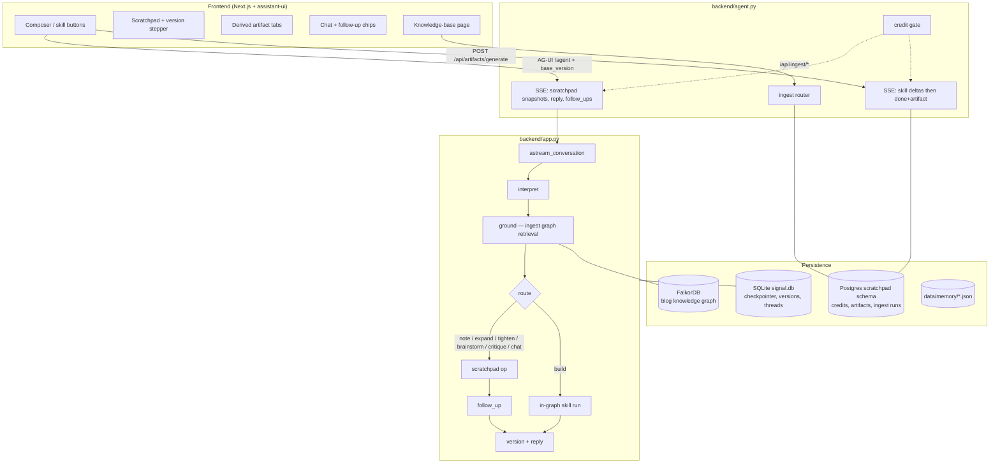

# Scratchpad

A thinking surface for people who write. You dump a messy idea, work it with a
partner until it feels true, then turn it into a real piece — without inventing
facts you never gave it.

---

## The idea

A scratchpad is one living document for a single train of thought. It is not
the finished blog post, LinkedIn update, or campaign. It is the notes, the
angles, the facts you can stand behind, and the questions still open.

You talk in the chat. The scratchpad updates on the right. When the notes are
good enough, you press a button and Scratchpad builds a finished piece from
those notes only.

It will not publish, schedule, or send anything for you. It will not quietly
make up a number, a customer, or a result. If something is unconfirmed, it
marks it as a question.

## How a session goes

1. **Jot** — paste a sentence, a hunch, or three bullets. No format required.
2. **Work it** — develop a line, tighten a paragraph, ask for other angles, or
   get an editor’s read. Earlier versions stay available; you can step back
   and continue from one of them.
3. **Build** — when you are ready, generate a blog outline, a social post, or
   a marketing campaign from the current notes.
4. **(Optional) Teach it your writing** — point it at your public blog. It
   reads a sample of posts so later answers can match how you already write
   and what you have already said.

New chats start empty. Each thread is its own scratchpad.

## What you can do

- One scratchpad per conversation, always visible, always editable in spirit
  (the notes are the source of truth, not the chat bubble).
- Capture raw notes in your own words, without turning them into a “post.”
- Develop a rough note into fuller writing.
- Tighten a specific passage without rewriting everything else.
- Brainstorm several distinct angles and pick one.
- Critique the notes; gaps land as open questions, not as fake confidence.
- Flag unconfirmed claims instead of inventing them.
- Allow still-forming ideas, clearly marked as assumptions.
- Version history with a cap; step back and branch from an older take.
- Skill buttons that produce a finished **blog outline**, **social post**, or
  **marketing campaign** from the current notes.
- Each skill run is saved as its own take so you can compare versions.
- Suggested next moves after a useful turn (click to continue).
- Google sign-in; the browser never talks to the writing engine as a stranger.
- Usage credits per message and per generated piece (when enabled).
- Knowledge base: paste a blog URL, pick articles, store them for later.
- Ask questions against your ingested posts (“what have I already said about X”).
- Stay in your house voice and topics when a knowledge base is present.
- Honest refusal to publish, post, or schedule.
- Feedback box on a turn so a bad reply can be reported.
- Thread list so you can return to earlier work.
- Separate live (production) and experiment (dev) deployments.

## A few ways to use it

- **Shape an idea into a story** — bring a rough product thought, launch idea,
  or feature note and explore the strongest angles before choosing a direction.
- **Turn thinking into content** — transform the finished scratchpad into a
  blog outline, social post, or lightweight marketing campaign.
- **Edit with more confidence** — tighten a draft, question its weak points, and
  surface claims that still need confirmation.
- **Write in an established voice** — connect a public blog, build a knowledge
  base from its articles, and keep future work consistent with that writing.
- **Build on what you have already said** — ask questions about ingested posts
  before creating something new, so the next piece can extend the story rather
  than repeat or contradict it.

## Who it is for

Founders and marketers shaping a launch. Writers who think by writing. Product
and engineering turning a feature into words. Anyone with more ideas than
finished pieces.

## Who it is not for

People who want an agent to research the open web, post to social networks, or
act as a general chat bot. Scratchpad stays on *your* notes and, optionally,
*your* blog.

---

## Under the hood

Env vars and the SQLite file still use a `SIGNAL_` / `signal.db` prefix. That
is a compatibility identifier used internally; the product is Scratchpad.
Renaming those variables and files is deferred.

### Architecture

```
chat turn
  → interpret (structured TurnPlan, temperature 0)
  → ground (retrieve from the account’s ingested blog graph, if any)
  → route
       note | expand | tighten | brainstorm | critique | chat
         → follow-up suggestions
       build (legacy in-graph path; the UI skills do not use this)
  → scratchpad version saved (cap 50)

skill button
  → POST /api/artifacts/generate
  → run_skill(scratchpad snapshot) → Postgres-versioned artifact
```

#### Agentic workflow


```mermaid
flowchart TD
    subgraph FE["Frontend (Next.js + assistant-ui)"]
        COMP["Composer / skill buttons"]
        P1["Scratchpad + version stepper"]
        P2["Derived artifact tabs"]
        CHAT["Chat + follow-up chips"]
        KB["Knowledge-base page"]
    end

    COMP -->|"AG-UI /agent + base_version"| EP
    COMP -->|"POST /api/artifacts/generate"| ART
    KB -->|"/api/ingest/*"| ING

    subgraph AGENT["backend/agent.py"]
        EP["SSE: scratchpad snapshots, reply, follow_ups"]
        ART["SSE: skill deltas then done+artifact"]
        ING["ingest router"]
        CRED["credit gate"]
    end

    EP --> AST
    CRED -.-> EP
    CRED -.-> ART

    subgraph APP["backend/app.py"]
        AST["astream_conversation"] --> INT["interpret"]
        INT --> GND["ground — ingest graph retrieval"]
        GND --> RT{"route"}
        RT -->|"note / expand / tighten / brainstorm / critique / chat"| SOP["scratchpad op"]
        SOP --> FU["follow_up"]
        RT -->|"build"| BLD["in-graph skill run"]
        FU --> FIN["version + reply"]
        BLD --> FIN
    end

    subgraph STORE["Persistence"]
        SQL[("SQLite signal.db\ncheckpointer, versions, threads")]
        PG[("Postgres scratchpad schema\ncredits, artifacts, ingest runs")]
        FDB[("FalkorDB\nblog knowledge graph")]
        MEM[("data/memory/*.json")]
    end

    APP --- SQL
    ART --- PG
    ING --- PG
    GND --- FDB
```

Entry points:

- `run_conversation(...)` / `astream_conversation(...)` in `backend/app.py`
- AG-UI `POST /agent` plus REST: `/api/artifacts/generate`, `/api/ingest/*`,
  `/api/feedback`, `/api/account`

### Stack

| Piece | Choice |
| --- | --- |
| Orchestration | LangGraph (`AsyncSqliteSaver`) |
| LLM | OpenRouter via `langchain-openai` (`backend/llm.py`) |
| Scratchpad ops | `backend/capabilities/writing.py` |
| Skills | `backend/skills/registry.py` + `backend/capabilities/skills.py` |
| Skill persistence | `backend/artifacts_store.py` (Postgres) |
| Ingest | `backend/ingest/` + FalkorDB (Graphiti) |
| Credits / accounts | `backend/credits.py` + `backend/db.py` (Supabase Postgres) |
| Prompts | `backend/prompts.py` (`SCRATCHPAD_V4`) |
| Safety | `backend/policy.py` + `backend/guardrails.json` |
| Scratchpad history | `backend/versions.py` (SQLite, cap 50) |
| Web | `backend/agent.py` — AG-UI SSE + extra routes |
| Auth | Google OAuth in the Next.js BFF; backend gated by shared secret |
| Tracing | Langfuse (`backend/tracing.py`) |
| Eval | pytest + DeepEval |

### Backend layout

```
backend/
  agent.py            AG-UI /agent, artifacts, feedback, mounts ingest
  app.py              LangGraph: interpret → ground → ops → follow_up
  artifact.py         Scratchpad + DerivedArtifact models
  signal_models.py    TurnPlan (note|expand|tighten|brainstorm|critique|chat|build)
  prompts.py          SCRATCHPAD_SYSTEM_PROMPT + changelog
  policy.py           deterministic guardrails
  versions.py         scratchpad version list
  artifacts_store.py  Postgres skill-output versions
  credits.py  db.py   accounts + ledger
  tracing.py          Langfuse + feedback recording
  threads_store.py    per-user thread registry (SQLite)
  llm.py  config.py  memory_store.py  textutil.py  terminal_chat.py
  capabilities/
    writing.py        note/expand/tighten/brainstorm/critique/follow_ups/grounding_notes
    skills.py         run_skill(snapshot) → streamed output
  ingest/             blog discover → select → graph ingest + query
  skills/
    registry.py
    blog_outline/  social_post/  marketing_campaign/
```

### Guardrails

Deterministic (code, not a prompt):

- No publish / send / schedule — canned honest reply.
- Skill allow-list from `guardrails.json`.
- Skills receive only a scratchpad snapshot (no live web on that path).
- Skill output cannot mutate the scratchpad.
- Empty expansions/artifacts are dropped.
- Scratchpad history capped at 50; `base_version` is range-checked.

Claim-level flags still land in `open_questions`. Ingest retrieval is additive
and fail-open: if the graph is empty or errors, the turn continues.

### Quick start (local, no Docker)

```bash
cd <scratchpad-directory>
python -m venv .venv && source .venv/bin/activate
pip install -r backend/requirements.txt
cp .env.example .env      # OPENROUTER_API_KEY, OPENROUTER_MODEL
```

```python
from backend.app import run_conversation

result = run_conversation(
    user_id="demo-user",
    conversation_id="demo-thread",
    user_message="Jot this down: we're launching faster cold starts for edge functions.",
)
print(result["assistant_message"])
print(result["artifact"]["body"])
```

```bash
python -m backend.terminal_chat
```

### Web app

```bash
uvicorn backend.agent:app --reload --port 8001
cd frontend && npm run dev          # typically http://localhost:3000/app
```

Docker (this is what production and the public hosts use):

```bash
docker compose up -d --build                         # prod: :5173 and :8001
docker compose -f docker-compose.test.yml up -d --build   # dev: :5174 and :8002
```

| | Production | Dev / test |
| --- | --- | --- |
| Compose | `docker-compose.yml` | `docker-compose.test.yml` |
| Public host | `scratchpad.raunaqness.com` | `dev-scratchpad.raunaqness.com` |
| Frontend service | `scratchpad-frontend` | `scratchpad-test-frontend` |
| Cloudflare origin | `http://scratchpad-frontend:5173` | `http://scratchpad-test-frontend:5173` |
| Host ports | 5173 / 8001 | 5174 / 8002 |

Cloudflare must use the **container** port `5173` and the Docker DNS name on
`tvbox_default`, not `localhost`.

UI notes: version stepper + branch-from-past confirmation; skill bar hits
`/api/artifacts/generate`; follow-up chips after a turn; knowledge base at
`/knowledge-base`.

### Auth, credits, and tracing

- **Google login** in the Next BFF (`/api/auth/*`). Session JWT uses
  `SIGNAL_SESSION_SECRET`. Browser → Next only; Next injects `user_id` and
  `x-signal-proxy-secret`.
- **Credits** when `SIGNAL_DATABASE_URL` is set: one debit per chat turn and
  per skill generation; 402 when enforce is on and the balance is 0.
- **Langfuse:** one trace per turn (`session_id = thread_id`, `user_id = Google
  sub`). Failures are swallowed.

### Environment

| Variable | Purpose |
| --- | --- |
| `OPENROUTER_API_KEY`, `OPENROUTER_MODEL` | required for live runs |
| `OPENROUTER_TEMPERATURE_CREATIVE` | follow-ups and skill writers |
| `OPENROUTER_EMBEDDING_MODEL` | ingest embeddings |
| `SIGNAL_INTERPRET_TEMPERATURE` | turn interpreter (default 0.0) |
| `SIGNAL_DATA_DIR` | root for `signal.db` and `memory/` |
| `SIGNAL_DB_PATH` | override SQLite path |
| `SIGNAL_CORS_ORIGINS` | allowed origins for `/agent` |
| `SIGNAL_HISTORY_WINDOW`, `SIGNAL_SUMMARIZE_AFTER` | transcript windowing |
| `SIGNAL_DATABASE_URL` | Postgres (credits, artifacts, ingest metadata) |
| `SIGNAL_CREDITS_ENABLED`, `SIGNAL_CREDITS_ENFORCE` | ledger / hard stop at 0 |
| `SIGNAL_SIGNUP_CREDITS`, `SIGNAL_MESSAGE_COST` | grant and per-turn cost |
| `INGEST_FALKORDB_HOST`, `INGEST_FALKORDB_PORT` | knowledge graph |
| `LANGFUSE_*` | tracing |
| `GOOGLE_AUTH_ENABLED`, `GOOGLE_CLIENT_*`, `GOOGLE_REDIRECT_URI` | OAuth |
| `SIGNAL_SESSION_SECRET` | cookie + Next↔backend secret |
| `SIGNAL_COOKIE_SECURE` | `false` only for plain HTTP |
| `SIGNAL_BACKEND_URL` | Next BFF → Python (compose sets this) |

### Testing

```bash
pytest -q tests/test_backend.py tests/test_streaming.py tests/test_agent_events.py \
  tests/test_artifacts.py tests/test_credits.py tests/test_auth_proxy.py tests/test_grounding.py
```

Live / DeepEval (needs an OpenRouter key; skip otherwise):

```bash
pytest -q -s tests/test_conversations.py tests/test_skills_deepeval.py \
  tests/test_helpful_tone_deepeval.py tests/test_recorded_conversations_deepeval.py
./run_deepeval_matrix.sh
```

### Workflow rules

- Scratchpad stays format-neutral. Hashtags, hooks, and word ceilings belong
  on the `social_post` skill.
- Skills (`blog_outline`, `social_post`, `marketing_campaign`) read only the
  current snapshot.
- Unverified specifics become open questions. Assumptions stay labelled.
- Ingested blog facts may be used when present; the open web is not crawled
  on a chat turn.
- Never publish, schedule, or send.
- At most one clarifying question per turn.
