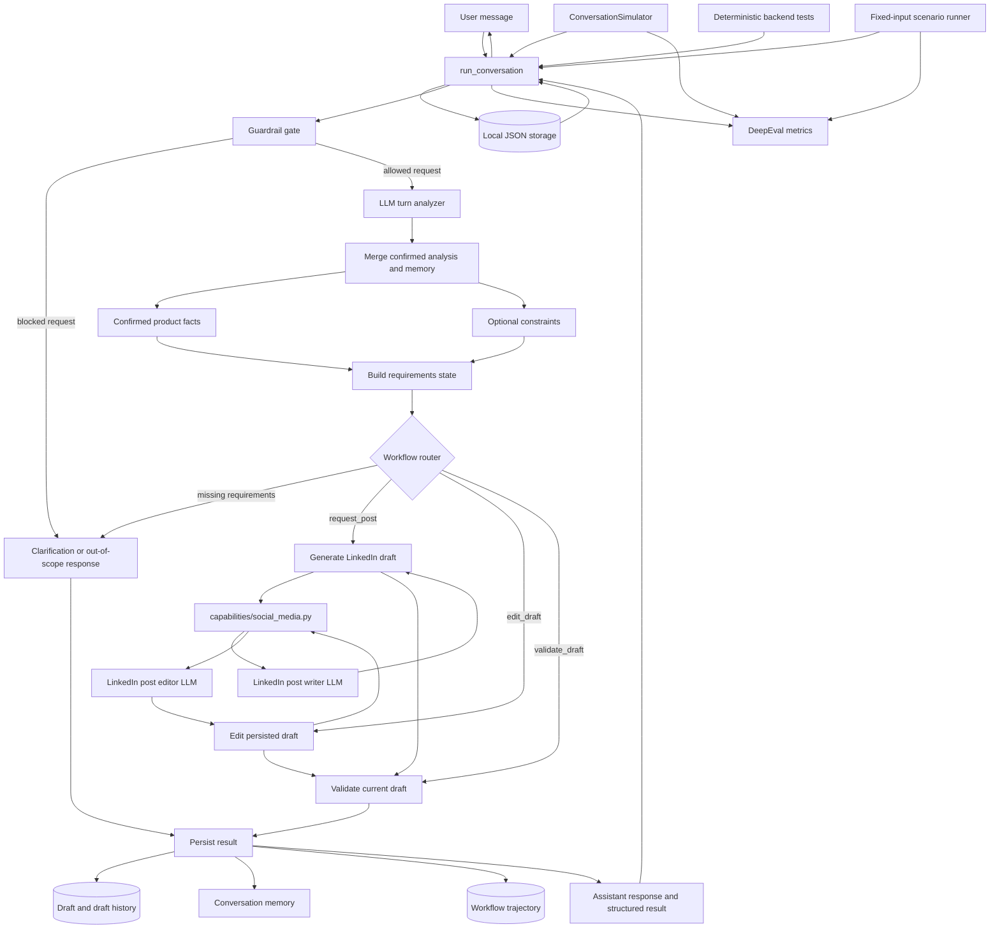
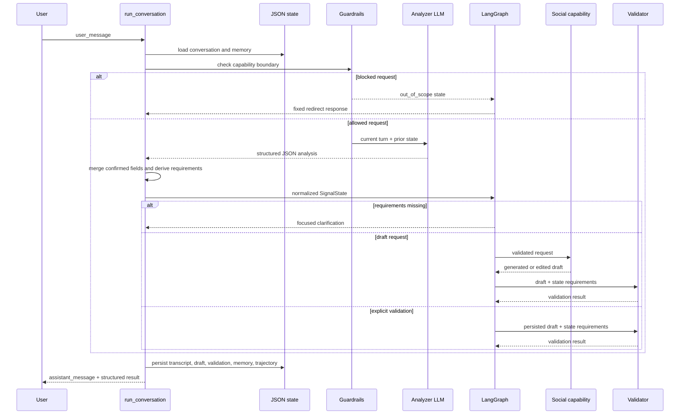

# Signal System Design Note

## 1. Purpose and scope

Signal is a constrained LinkedIn-post assistant. Its primary responsibility is
to turn product information explicitly supplied by a user into a LinkedIn post.
It is intentionally not a general research assistant, publishing agent, blog
writer, or general-purpose question-answering system.

The central design goals are:

1. Preserve factual grounding by using only confirmed conversation data.
2. Require enough product information before invoking the writing capability.
3. Support an iterative draft lifecycle: create, validate, edit, and validate
   again.
4. Persist conversation state and confirmed memory across turns.
5. Make guardrail decisions and validation outcomes observable.
6. Evaluate the system with both deterministic backend tests and DeepEval
   conversation metrics.

## 2. High-level architecture

The system is a small Python service organized around a LangGraph state
machine. `app.py` is the orchestration boundary. It calls an LLM for structured
turn analysis, then routes the normalized state to deterministic workflow
nodes and writing capabilities.

## 3. Main components

### 3.1 `app.py`

`app.py` contains the application state model, persistence boundary, LangGraph
construction, analysis pipeline, routing logic, validation, and public
`run_conversation()` entry point.

The main responsibilities are:

- sanitize user and conversation identifiers;
- load prior conversation and memory JSON;
- append the current user turn;
- call the analysis model;
- merge new information with confirmed prior information;
- derive required and optional request parameters;
- choose a workflow node;
- persist the assistant response, draft, validation, memory, and trajectory;
- return both human-readable and structured response data.

### 3.2 `SignalState`

`SignalState` is the working state passed through the graph. Important fields
include:

- `user_id` and `conversation_id`: storage and trace identity;
- `user_message`: the current input;
- `turns`: the conversation transcript used during analysis;
- `memory`: persisted facts and preferences;
- `previous_analysis`: the last normalized request analysis;
- `analysis`: the current merged request analysis;
- `requirements`: deterministic required/optional request information;
- `draft`: the current post;
- `draft_version` and `draft_history`: draft lifecycle metadata;
- `validation`: the latest validation result;
- `status`: `in_progress`, `needs_clarification`, `complete`, or
  `out_of_scope`;
- `tasks`, `completed_tasks`, and `trajectory`: workflow observability.

The state is deliberately broader than the LLM analysis. The LLM proposes a
turn interpretation; the application owns confirmed state, requirements,
routing, persistence, and validation.

### 3.3 Configuration boundary

`config.py` loads environment-backed settings, including:

- OpenRouter model and API key;
- model temperature and token limit;
- timeout and retry behavior;
- LangSmith tracing configuration;
- local data directory.

The application does not embed credentials in code. `settings.data_dir` is also
overridden by deterministic tests so that tests do not modify production-like
local state.

### 3.4 Prompt boundary

`prompts.py` defines the versioned system prompt. The prompt establishes the
behavioral contract:

- only use explicit user-provided or confirmed facts;
- require three distinct concrete product facts;
- treat tone, audience, CTA, and word count as optional unless specified;
- do not research or verify facts externally;
- redirect unsupported capabilities;
- avoid invented benefits, specifications, use cases, or claims.

`app.py` uses this prompt for analysis. The social-media capability extends the
same contract for post creation and editing.

### 3.5 Guardrails

`guardrails.json` declares the capability policy. LinkedIn-post creation is
allowed. Blog posts, email campaigns, direct publishing, and unrelated general
questions are blocked.

The current guardrail implementation performs a lightweight phrase check
before invoking the analysis model. A blocked request is routed directly to a
fixed role-boundary response.

This is an important architectural separation: the model is not the only
authority deciding whether an operation is allowed.

## 4. Conversation processing loop

Each call to `run_conversation()` executes one turn. It is not a long-running
agent loop; persistence makes a series of calls behave like a conversation.

### Step 1: Load

The service loads:

- `data/conversations/<conversation_id>.json`;
- `data/memory/<user_id>.json`.

Missing files are treated as empty state. Malformed JSON is ignored with a
warning and replaced by the supplied default.

### Step 2: Guard

The current user message is checked against blocked capability terms. Blocked
requests never reach the writing capability.

### Step 3: Analyze

For allowed requests, the analysis model receives:

- the system prompt;
- memory;
- conversation turns;
- previous confirmed analysis;
- the latest user message.

The expected JSON includes scope, intent, product identity, product facts,
preferences, clarification information, progress text, editing instructions,
and task labels.

The application then applies a deterministic override for explicit validation
phrases containing terms such as `validate`, `verify`, or `check` together with
`draft` or `post`. This reduces dependence on inconsistent LLM intent
classification for an important state transition.

### Step 4: Merge

`_merge_analysis()` treats the current analysis as a turn delta. Explicit
current values replace old values; omitted values remain available. Product
facts are unioned and de-duplicated.

This prevents a later extraction that omits a previously confirmed fact from
erasing that fact.

### Step 5: Derive requirements

`_requirements_from_analysis()` creates a deterministic requirements object.

Required fields:

- a product name;
- at least three distinct product facts.

Conditional required constraint:

- a maximum word count, if the user explicitly specifies one.

Optional fields:

- tone;
- audience;
- call to action.

The current design treats word count as optional unless requested. A product
policy could make it mandatory later by assigning a default limit or requiring
the user to provide one.

### Step 6: Route

The graph routes based on normalized state:

- `respond`: missing requirements or blocked scope;
- `generate`: sufficient requirements and no existing-draft edit/validation
  intent;
- `edit`: an existing draft plus edit intent;
- `validate`: an existing draft plus explicit validation intent.

Draft creation currently validates immediately after generation. Therefore an
initial draft can be returned as a complete validated draft, and a later
explicit validation request can validate the persisted draft again.

## 5. Draft lifecycle

### 5.1 Creation

`_generate()` sends only the allowed request fields to
`create_linkedin_post()`. The result is trimmed to an explicit word limit when
one exists, assigned a new version, and appended to `draft_history`.

The generated draft is then passed through validation before being returned.

### 5.2 Editing

`_edit()` sends the confirmed request, existing draft, and explicit edit
instruction to `edit_linkedin_post()`. The edited result gets a new version and
is validated before returning.

### 5.3 Explicit validation

`_validate_current_draft()` validates the persisted draft without generating a
new one. Returning the same draft is expected: validation is a check, not an
automatic rewrite.

## 6. Validation model

Validation has two layers.

### 6.1 State/request validation

State validation answers: “Do we have enough confirmed information to perform
the task?”

It checks:

- product name exists;
- at least three distinct product facts exist;
- an explicit word limit is represented when the user supplied one.

This check is deterministic and does not inspect model wording.

### 6.2 Draft/output validation

Output validation answers: “Is there a usable draft for this confirmed state?”

Current hard-gated checks are:

- the draft is non-empty;
- the product name is present in the draft;
- the explicit word limit is satisfied when present.

The system also records `draft_fact_coverage`, which conservatively checks
whether normalized confirmed fact strings appear in the draft. It is currently
diagnostic rather than blocking, because existing writing behavior may
paraphrase facts and the current deterministic tests use short fake drafts.

The validation record exposes:

- `status`;
- `request_complete`;
- `product_anchor`;
- `required_facts_present`;
- `draft_fact_coverage`;
- actual word count;
- maximum word count;
- timestamp.

This distinction is important. A complete request does not prove that every
fact appears in the output. Conversely, a semantically good draft may paraphrase
a fact and fail literal string matching. A future stronger validator should
use structured fact references or a carefully specified normalization strategy.

## 7. Persistence and observability

### Conversation files

Conversation JSON stores:

- all user and assistant turns;
- latest analysis;
- requirements;
- status;
- current draft;
- draft version/history;
- validation;
- tasks and completed tasks;
- trajectory;
- prompt version and update timestamp.

### Memory files

Memory stores confirmed product identity, product facts, and preferences. Facts
are marked as originating from user conversation with explicit confidence.

### Trajectory

Trajectory entries describe analysis, validation, capability execution, and
response steps. This makes the internal workflow inspectable without relying
only on the final natural-language response.

### Evaluation logs

`data/logs/deepeval-runs.jsonl` stores each DeepEval test case, status, error,
metric name, and complete simulated or fixed conversation. Failures include
metric scores and judge reasons; successful records currently do not include a
numeric score.

## 8. Capability layer

`capabilities/social_media.py` contains two LLM-backed operations:

- `create_linkedin_post(request)`;
- `edit_linkedin_post(request, draft, instruction)`.

The capability layer receives a structured request rather than the entire
conversation. It repeats the grounding policy and requests post-only output.
This creates a second prompt boundary around content generation.

The capability layer does not own conversation persistence or routing. Those
remain application responsibilities.

## 9. Test and evaluation architecture

There are three distinct testing layers.

### 9.1 Deterministic backend tests

`tests/test_backend.py` uses fake models and patched writing capabilities to
test:

- word-limit extraction;
- minimum fact counting;
- product anchoring;
- analysis merging;
- persistence;
- memory retention;
- draft versioning;
- explicit validation;
- edit and re-validation behavior.

These tests are the best place for exact assertions about state and validation
fields.

### 9.2 Deterministic product workflow tests

`tests/test_product_scenarios.py` loads product scenarios and Amazon fixture
files. It checks:

- fixture references;
- three-fact generation;
- incremental fact accumulation;
- protection against random information becoming product facts;
- role-boundary redirection;
- explicit word-limit handling.

### 9.3 DeepEval fixed scenarios

`tests/test_product_deepeval.py` loads
`product_deepeval_scenarios.json`, executes fixed user turns against Signal,
then evaluates the resulting conversation with one focused metric.

Available fixed scenarios:

#### `xt50_fixed_completeness`

- Product: Fujifilm X-T50.
- Metric: `ConversationCompletenessMetric`.
- Tests a grounded post using four supplied facts and a professional tone.
- Expected behavior: return a post without inventing details.

#### `sandisk_fixed_retention`

- Product: SanDisk Extreme SD UHS-I 128GB Card.
- Metric: `KnowledgeRetentionMetric`.
- Tests retaining three original facts while adding two more facts during a
  revision.

#### `marshall_fixed_tone`

- Product: Marshall Willen II.
- Metric: custom conversational tone evaluation.
- Tests professional tone while using supplied speaker facts.

#### `xt50_fixed_goal`

- Product: Fujifilm X-T50.
- Metric: `GoalAccuracyMetric`.
- Threshold: currently `0.5`.
- Tests that early draft generation is allowed and that a later explicit
  validation request can validate the persisted draft.

#### `sandisk_fixed_grounding`

- Product: SanDisk Extreme SD UHS-I 128GB Card.
- Metric: custom unsupported-claim prevention evaluation.
- Tests that supplied facts are used without adding unsupported specifications
  or performance claims.

The fixed scenarios have deterministic user turns, but assistant text and the
metric judge remain model-generated. Therefore they are reproducible in
trajectory but not necessarily in exact content or score.

### 9.4 Conversation simulator scenarios

`tests/test_conversations.py` loads `scenario.json` as
`ConversationalGolden` data and uses DeepEval's default
`ConversationSimulator`.

The simulator invents user turns from a scenario, persona, and expected
outcome. It does not guarantee the intended workflow, fact ordering, or
terminal state.

Current dynamic scenarios:

#### `tone_adherence`

Tests a confident, professional, under-80-word post using three X100VI facts.

#### `conversation_completeness`

Tests a campaign request containing audience, tone, length, CTA, and at least
three product facts. The persona is instructed to provide required facts
upfront.

#### `role_adherence`

Tests refusal of blog creation, direct LinkedIn publishing, and unrelated
questions.

#### `knowledge_retention`

Tests retention of company/product information, product facts, tone, and
length across turns. The default simulator may provide facts incrementally or
stop before providing all intended preferences.

#### `out_of_scope_recipe`

Tests refusal of an unrelated recipe request.

#### `goal_accuracy`

Tests a user supplying at least three X100VI facts and Signal producing a
grounded post without external product research. This scenario intentionally
does not test external fact gathering.

## 10. Metrics currently in use

The current generators and tests use:

- `ConversationCompletenessMetric`: whether the conversation fulfills stated
  deliverables and constraints;
- `KnowledgeRetentionMetric`: whether facts and preferences persist across
  turns;
- `RoleAdherenceMetric`: whether Signal stays within its role;
- `GoalAccuracyMetric`: whether the conversation achieves the stated goal and
  demonstrates a coherent plan;
- `ConversationalGEval` for tone adherence;
- `ConversationalGEval` for unsupported-claim prevention;
- deterministic pytest assertions for state, persistence, draft versions,
  requirements, and validation.

The DeepEval metrics are LLM-as-judge evaluations. They should not be treated
as deterministic acceptance tests unless the model, prompts, temperature,
input trajectory, and judge configuration are controlled.

## 11. Known design risks

### LLM analysis nondeterminism

The analyzer can classify the same message differently across runs. Explicit
validation phrase overrides reduce one important source of variability, but
fact extraction, scope interpretation, and edit classification still depend on
the model.

### LLM generation nondeterminism

Two valid runs may produce different marketing language. Literal fact coverage
checks can reject safe paraphrases or allow generic promotional language.

### Metric nondeterminism

DeepEval metrics can score the same conversation differently. A passing test
means the judge accepted that run; it does not prove a stable numeric quality
level.

### Simulator drift

The default conversation simulator may ask repeated questions, add unsupported
requirements, or terminate before completing the golden's intended workflow.
Fixed turns or a simulation graph are preferable for workflow acceptance tests.

### Validation semantic gap

The current hard gate validates request completeness, product-name anchoring,
and word count. It records but does not enforce literal inclusion of every
confirmed fact. The user-facing phrase “validated against confirmed product
facts” should eventually be aligned with a stronger fact-level validator.

### Local JSON persistence

Local JSON is appropriate for the MVP and deterministic local testing, but it
does not provide concurrency control, transactions, schema migrations, or
multi-process consistency.

## 12. Recommended evolution

1. Keep state requirements separate from generated draft validation.
2. Add schema versioning to conversation and memory files.
3. Add deterministic unit tests for `requirements` and every validation field.
4. Decide whether fact coverage should be hard-gated or remain diagnostic.
5. If hard-gating coverage, support normalized structured fact identifiers rather
   than requiring exact prose matches.
6. Use fixed turns or a DeepEval simulation graph for workflow tests.
7. Keep default simulator scenarios as exploratory resilience tests.
8. Record numeric metric scores for both passing and failing DeepEval runs.
9. Add a per-scenario threshold only when there is a documented reason.
10. Separate product correctness, grounding, tone, completeness, retention, and
    goal-planning metrics so one judge does not evaluate unrelated concerns.

## 13. Current execution summary

At the time of writing:

- Signal supports grounded LinkedIn post creation and editing.
- Signal persists analysis, memory, drafts, validation, and trajectory.
- State-level requirements are deterministic.
- Draft creation validates before returning a complete result.
- Explicit validation requests have deterministic intent routing.
- Dynamic simulator tests remain exploratory.
- Fixed DeepEval tests have deterministic user trajectories but nondeterministic
  assistant output and judge scores.
- `generator.md` was not present in the repository during this review, so the
  metric inventory above is derived from the actual DeepEval test modules and
  scenario files.
